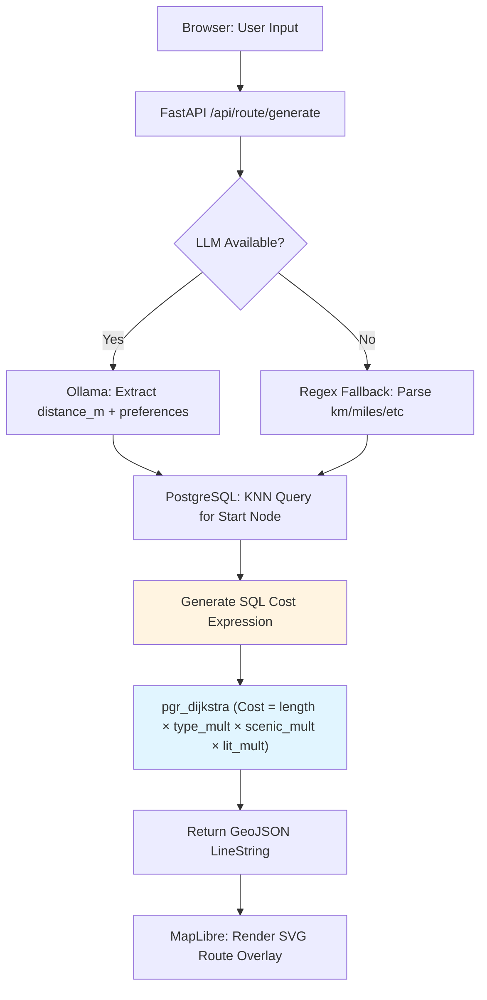

# Strider


A running route planner that generates navigable loop routes from natural language input. Strider's core mechanism: user preferences are translated into dynamic SQL cost expressions and injected directly into `pgr_dijkstra`, biasing pathfinding without hardcoded UI filters.

## Features

- **Dynamic Cost Routing**: User preferences (e.g., "quiet", "trails", "scenic") are compiled into SQL CASE expressions that modify edge weights in real-time during Dijkstra execution. The LLM's sole role is parameter extraction—routing logic remains in PostgreSQL.
- **Two-Layer Graceful Degradation**: LLM-to-regex fallback for prompt parsing; database routing fails over to geometric stub loops when graph data is unavailable or unreachable.
- **OSM Data Pipeline**: Overpass API fetches road network geometry; edge weights are pre-scored (road type, scenic tags, lighting) and stored in `routing.edges` for cost expression evaluation.
- **Connected Component Pruning**: `pgr_connectedComponents` removes isolated subgraphs below a configurable node threshold, ensuring waypoints are reachable from the start node.
- **Live Weather Integration**: LLM generates contextual weather advisories (e.g., "start into headwind") based on real-time API data passed at request time.
- **Coverage-Aware UI**: Haversine-based radius check disables route generation outside the ingested geographic bounds, displaying the configured coverage area on the map.

## Tech Stack

- **Frontend: React + MapLibre GL**: Declarative UI with GPU-accelerated vector tile rendering for low-latency map interactions.
- **Backend: FastAPI + Python**: Async ASGI framework with type-safe contracts via Pydantic.
- **Database: PostgreSQL + PostGIS + pgRouting**: Spatial queries and graph algorithms execute server-side; eliminates serialization overhead (data gravity).
- **Infrastructure: Docker + Docker Compose**: Reproducible dev environment with health checks and profile-based graph initialization.
- **LLM Engine: Ollama + Qwen 1.5B**: Local inference with <2GB memory footprint; sub-second latency for parameter extraction.

## Architecture



**Key design decisions:**

- **Compute Gravity**: Routing logic runs in PostgreSQL to avoid serializing ~50k edges per request. SQL cost expressions are 10–30× faster than client-side graph libraries.
- **Narrow LLM Scope**: The model extracts 4 parameters (distance, preferences, lat/lng). It does not generate routes, compute paths, or perform spatial operations.
- **Drop-in Model Replaceability**: Any OpenAI-compatible API (Ollama, vLLM, GPT-4) can replace the LLM via environment variable; fallback regex ensures zero hard dependencies.

## Project Structure

```
strider/
├── backend/
│   ├── app/
│   │   ├── main.py              # FastAPI routes (/api/route/*, /health)
│   │   ├── database.py          # SQLAlchemy engine + connection pooling
│   │   ├── models/              # Pydantic contracts (RouteRequest, RouteResponse)
│   │   └── services/
│   │       ├── llm.py           # OpenAI client + regex fallback parser
│   │       ├── routing.py       # pgr_dijkstra SQL generation + stub loop logic
│   │       └── geojson.py       # PostGIS → lat/lng coordinate parsing
│   ├── scripts/
│   │   ├── ingest_pipeline.py   # Orchestration: Overpass API → scoring → pruning
│   │   ├── ingest_overpass.py   # OSM way → edge/node table insertion
│   │   └── prepare_topology.py  # pgr_connectedComponents + cleanup
│   └── Dockerfile
├── frontend/
│   ├── src/
│   │   ├── components/
│   │   │   ├── RouteMapPanel.tsx   # MapLibre map + route overlay rendering
│   │   │   └── LeftPanel.tsx       # Prompt input + parameter controls
│   │   ├── services/
│   │   │   └── api.ts              # Axios client for /api/route/* endpoints
│   │   └── App.tsx
│   └── package.json
├── .github/workflows/            # CI/CD: backend tests, frontend build, security scans
└── docker-compose.yml            # Multi-container stack (postgres, backend, graph-init profile)
```

## Getting Started

### Prerequisites

- **Docker**: Container runtime for PostgreSQL + backend services
- **Node.js 18+**: Frontend development server (Vite)
- **Ollama with `qwen2.5:1.5b`**: Run `ollama pull qwen2.5:1.5b` before starting backend

### Installation

```bash
# 1. Copy environment configuration
cp .env.example .env

# 2. Start PostgreSQL with PostGIS/pgRouting extensions
docker compose up -d postgres adminer

# 3. Initialize routing graph (runs Overpass ingestion + topology prep)
docker compose --profile manual up graph-init

# 4. Start backend API server
docker compose up backend

# 5. Install frontend dependencies and start dev server
cd frontend
npm install
npm run dev
```

### Verification

```bash
# Run backend tests (requires active database connection)
cd backend
pytest -v
```

**Service endpoints:**

- Frontend UI: http://localhost:5173
- Backend API: http://localhost:8000/docs (OpenAPI spec)
- Health Check: http://localhost:8000/health (reports DB + LLM status)
- Database Admin: http://localhost:8080 (Adminer)

## Usage

1. **Navigate to http://localhost:5173** and allow browser location access (or manually set a start point on the map).
2. **Enter a natural language prompt** in the left panel:
   - "5km quiet run avoiding main roads"
   - "3 mile scenic loop through trails"
   - "8k well-lit route for evening run"
3. **Click "Generate Route"** to compute and render the loop on the map.
4. **Use "Regenerate"** to compute a new route with identical parameters (skips LLM inference, reuses last-known preferences).
5. **Check `/health` endpoint** to verify graph initialization status:
   ```bash
   curl http://localhost:8000/health | jq
   ```
   Response includes `database.graph_ready` (true if nodes/edges exist) and `llm.configured` (true if Ollama URL is set).
